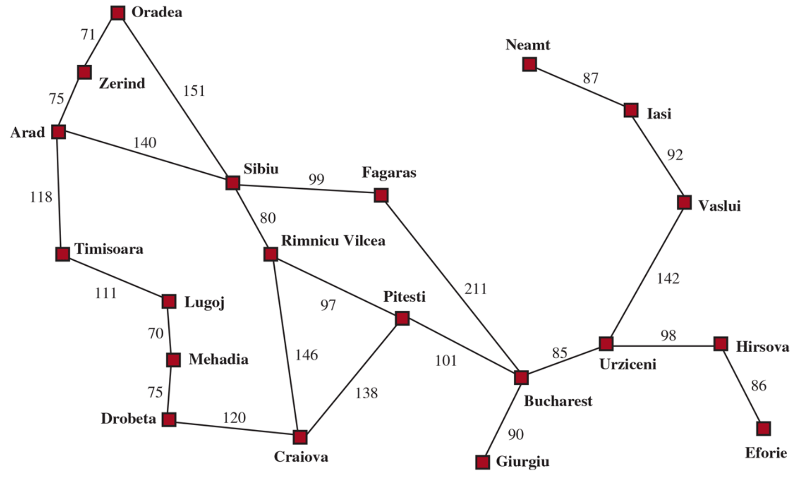

# Romaia City App

CS 534 - Artificial Intelligence 

Individual Project # 2 - Romania City App

Azzam Shaikh

March 3, 2024

## Background
The purpose of this assignment is to develop a program that can find the best path between any two cities in Romania. The map of Romania can be seen below in Figure 1.

<figure>
    
    <figcaption>Figure 1: Romania map [1]</figcaption>
</figure>

A Problem-Solving Agent program has been developed to find the best path between two user defined cities. In order to find the best path, the agent will call on two informed search algorithms - Greedy Best-First Search and A* Search - and two local search algorithms - Hill Climbing and Simulated Annealing. 

## Run Instructions

To run the RomaniaCityApp program, if Python is installed on your device, open the folder where this code is stored and run the following command: 

```python RomaniaCityApp.py```

If an IDE environment is preferred, such as PyCharm, open the folder where this code is stored in PyCharm, open the ```RomaniaCityApp.py``` file, and click Run.


## Program Structure

The overall file structure is shown below.

```
Shaikh_Azzam_CS_534_Individual_Project_#2
├── RomaniaCityApp
├── SimpleProblemSolvingAgent
├── utils
```

Each file is discussed more in detail below.

### RomaniaCityApp

This file, ```RomaniaCityApp.py```, runs the main, RomaniaCityApp program. This file contains a RomaniaCityApp class that creates a RomaniaCityApp object and runs the program. This object will ask the user for two valid cities, one start city and one goal city, from the Romania Map. The RomaniaCityApp object will then pass these values to the SimpleProblemSolvingAgent object. The SimpleProblemSolvingAgent object is discussed more below.

### SimpleProblemSolvingAgent

This file, ```SimpleProblemSolvingAgent.py```, is a supporting script for the main RomaniaCityApp program. This script allows the creation of a SimpleProblemSolvingAgent (SPSA) object that can be initialized with the initial state and input maps, in this case the Romania map. Once created, this object can be called with a goal arguement and the agent will solve and obtain the best path based on four different search algorithms. Supporting code and classes are stored in the SimpleProblemSolvingAgent file that helps the agent complete its task. A lot of the code in this file has been extracted from AIMA [2].

### utils

This file, ```utils.py```, is a supporting script for the SimpleProblemSolvingAgent. It contains support functions that are called by other functions. A lot of the code in this file has been extracted from AIMA [2].

## References

[1] S. Russel and P. Norvig, Artificial intelligence: a Modern approach., 4th ed. Prentice Hall, 2020.

[2] P. Norvig, “aimacode/aima-python: Python implementation of algorithms from Russell and Norvig’s ‘artificial intelligence - A modern approach,’” GitHub, https://github.com/aimacode/aima-python (accessed Feb. 13, 2024). 


